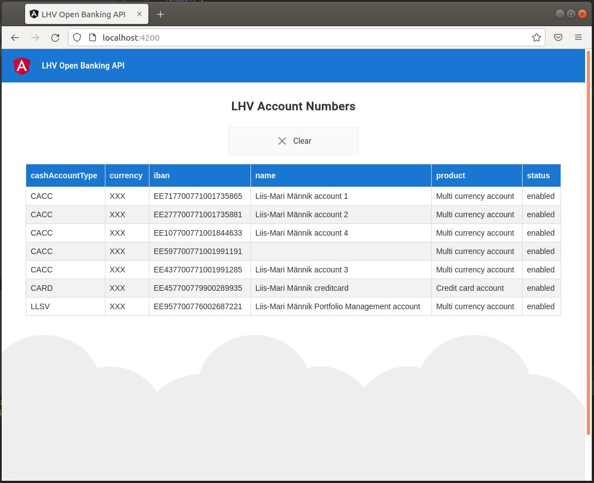

# LHV Open Banking API (NestJs/Angular)
Author: Martin Orgla

### Running the application 
1. `npm install`
2. `npm run nest-start` - Exposes NestJS service on port 3000 (http://localhost:3000)
3. `npm run angular-start` - Starts Angular application on port 4200 (http://localhost:4200)

### Testing
For production application I would add more tests. However for the scope of this homework assignment I believe that it's enough.

`npm run nest-test` - Run Nest controllers spec

`npm run angular-test` - Test Angular UI

### Notes for production application
* Key should be extracted from the certificate once and stored in the application configuration file
* Certificates should be stored safely and probably locations of the files should be passed with arguments to the application. At the moment certificate and key paths are hardcoded to the application
* To simplify testing certificate and key are also added to the repository (Yeah I know, shouldn't actually happen in real life)
* Run the application in docker, separate FE and BE etc.
* Add environment/configuration file with all the urls that application needs (Front end URL, LHV API URL etc.)
